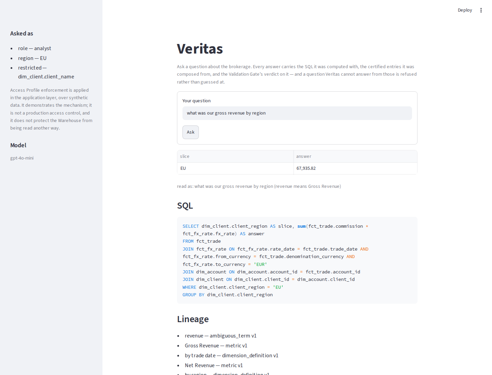
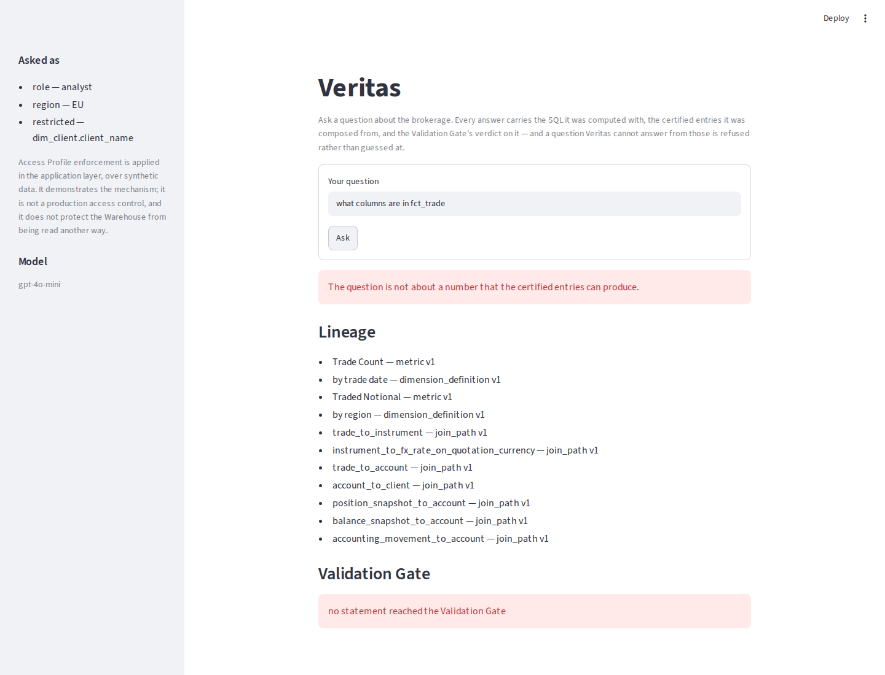
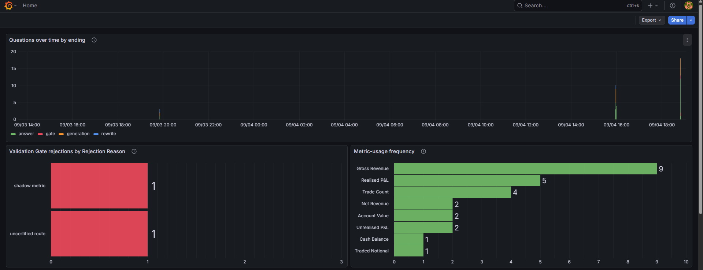
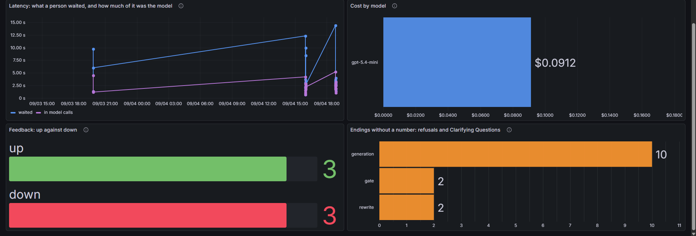

# Veritas

**A natural-language analytics copilot over a brokerage warehouse, whose answers
are grounded in a certified Semantic Layer and checked by deterministic code
before they run.**

Ask *"what was our net revenue last quarter?"* in a browser and Veritas comes back
with a number, the SQL that computed it, the certified definitions it was composed
from, and the verdict a Validation Gate reached on that SQL — or with a refusal, or
with a question asked back. It never returns a bare number.

Capstone for the [DataTalks.Club Large Language Model (LLM) Zoomcamp](https://github.com/DataTalksClub/llm-zoomcamp).

```bash
cp .env.example .env          # then put an OpenAI key in it
docker compose up -d --build  # the App, Postgres and Grafana
```

Then open **<http://localhost:8501>**.

---

## Where each rubric criterion is answered

Navigation, so a grader can tick rows in order. Every claim below is argued in the
section it links to.

| Criterion | Section |
|---|---|
| Problem description | [The problem](#the-problem) |
| Retrieval flow | [How Veritas answers a question](#how-veritas-answers-a-question) |
| Retrieval evaluation | [Evaluation → Retrieval](#retrieval-hit-rate-and-mean-reciprocal-rank) |
| LLM evaluation | [Evaluation → Generation](#generation-execution-accuracy-and-an-llm-as-judge) |
| Interface | [The App](#the-app) |
| Ingestion pipeline | [Ingestion](#ingestion-real-market-data-synthetic-client-activity) |
| Monitoring | [Monitoring](#monitoring) |
| Containerization | [Running Veritas](#running-veritas) |
| Reproducibility | [Running Veritas](#running-veritas) and [Credentials](#credentials-what-you-need-and-what-you-do-not) |
| Hybrid search | [Step 2 — retrieve](#how-veritas-answers-a-question) |
| Document re-ranking | [Step 2 — retrieve](#how-veritas-answers-a-question) |
| Query rewriting | [Step 1 — rewrite](#how-veritas-answers-a-question) |
| Extra credit | [The Validation Gate](#the-validation-gate) |

---

## The problem

Ask an LLM a business question over a data warehouse and it will write plausible
SQL. **Plausible is the problem.**

*"What was our revenue last quarter?"* has no single correct answer at a brokerage.
**Gross Revenue** is the commission the broker charged. **Net Revenue** is what it
actually kept, after every rebate paid to an introducing partner and every
pass-through fee. On the data in this repository they are measurably different numbers —
`uv run python .claude/scripts/check_warehouse.py --distinctions` prints how far apart,
and fails the run if they ever converge — and a model that silently picks one has
produced **a correct program computing the wrong number**.

That failure is worse than an error, because it is confident, well formatted, and
indistinguishable from a right answer. Repeated across a business it is how a
**Shadow Metric** layer forms: every question invents its own definition of revenue,
no two dashboards agree, and nobody can say which one is wrong.

Veritas takes the position that this is **not a model capability problem**. The
definitions already exist — in analysts' heads, in dbt models, in Business
Intelligence tools. They are simply not in front of the model at the moment it
writes SQL. It is a **grounding** problem, and its governing rule is:

> **The model never defines a metric. It may only select one from a certified
> Semantic Layer, and everything it generates is checked by code before it runs.**

Two consequences follow, and they are the whole design:

- **Retrieval is not a nicety, it is the correctness mechanism.** Retrieving the
  wrong Metric Definition *is* the wrong answer — which is why retrieval quality is
  measured here against derived ground truth rather than against an opinion.
- **Governance is deterministic.** The Validation Gate is ordinary code over the
  SQL parse tree, not a prompt asking the model to behave. Governance you can prove
  beats governance you request politely.

---

## How Veritas answers a question

The knowledge base is the **Semantic Layer** in [`semantic/`](semantic/) — thirty-two
YAML files, one per certified entry, in four kinds:

| Kind | Count | What one says |
|---|---|---|
| **Metric Definition** | 9 | A named, versioned SQL expression, the table it starts from, the joins it is certified over, its unit and its Reporting Currency. `Gross Revenue`, `Net Revenue`, `Realised P&L`, `Unrealised P&L`, `Trade Count`, `Traded Notional`, `Cash Balance`, `Account Value`, `Position Change`. |
| **Dimension Definition** | 5 | A certified axis to slice by — the column, its grain, its allowed values, and the routes that reach it from each fact table. |
| **Join Path** | 13 | One certified hop between two warehouse tables, so the model never invents a join. |
| **Ambiguous Term** | 5 | A word people say that maps to two or more metrics and therefore has no single answer — `revenue`, `pnl`, `balance`, `volume`, `how much does X have` — each with the spellings people actually use. |

A question runs through seven steps, all of them in
[`veritas/orchestrator/`](veritas/orchestrator/):

```
question
   │
   ├─ 1. REWRITE ──── resolve Ambiguous Terms against the Semantic Layer.
   │                  "revenue" is not answerable — ask which, or use the
   │                  one the question actually names.
   │
   ├─ 2. RETRIEVE ─── hybrid search over Semantic Entries, re-ranked.
   │                  Returns Metric Definitions, Dimension Definitions and
   │                  Join Paths — never raw table dumps.
   │
   ├─ 3. GROUND ───── build the prompt from retrieved entries only.
   │                  Metrics not retrieved are not available.
   │
   ├─ 4. GENERATE ─── SQL, composed from certified metric expressions.
   │
   ├─ 5. VALIDATE ─── deterministic, on the parse tree.  fail → explain, do
   │                  not execute.
   │
   ├─ 6. EXECUTE ──── against the Warehouse.
   │
   └─ 7. ANSWER ───── Grounded Answer: result, SQL, Lineage, Validation Gate
                      outcome.  Logged, and open to Feedback.
```

**Step 1 is query rewriting**, and it is the core disambiguation step rather than a
bolt-on. *"What was our revenue last quarter"* says an Ambiguous Term and nothing
resolves it, so Veritas asks back which of Gross and Net was meant. *"What was our
net revenue last quarter"* resolves it, and the resolved meaning is **spliced over**
the ambiguous word before retrieval — a form chosen by measurement, not taste (see
[Evaluation](#retrieval-hit-rate-and-mean-reciprocal-rank)). The five Ambiguous
Terms carry the spellings people actually use, so *"revenues"*, *"PnL"* and
*"turnover"* are recognised as the terms they are.

**Step 2 is hybrid search with re-ranking**, in [`veritas/retrieval/`](veritas/retrieval/).
Every Semantic Entry is rendered as the text a search may match, indexed four ways —
text (`minsearch`), vector (`BAAI/bge-small-en-v1.5`), their fusion, and that fusion
re-ranked by a cross-encoder (`Xenova/ms-marco-MiniLM-L-6-v2`) — and all four are
measured against each other. Retrieval then returns the entries a question scored
against **plus every entry those name**, because a Metric Definition without its Join
Paths cannot be turned into SQL. Both models are ONNX (Open Neural Network Exchange)
builds run through `fastembed`: no PyTorch, no key, no network at question time.

### The Validation Gate

Step 5 is where the extra credit is claimed. [`veritas/validation/`](veritas/validation/)
is deterministic code over the `sqlglot` parse tree, not a second model, and it
refuses a statement that:

- is not a single, parseable, bounded, read-only `SELECT`;
- computes anything that does not trace to a **Certified Metric** — a Shadow Metric;
- projects a **Restricted Column** the Access Profile forbids;
- computes a metric across joins its Metric Definition does not name, or over the
  wrong date column, or without a filter it is not certified against;
- slices a metric by an axis no certified route reaches from it;
- is not scoped to the region the Access Profile permits.

Each refusal carries a **Rejection Reason** from a stable taxonomy, which is what
the dashboard groups rejections by. The Gate's verdict is also what **Lineage** is
read off: an allowed statement names the metrics its expressions traced to, the axes
it sliced by and the Join Paths its route was certified by — so an answer cites what
it *used*, not what the model happened to be shown.

---

## Running Veritas

### With Docker — everything, one command

You need Docker and an OpenAI key. Nothing else.

```bash
git clone <this repository> && cd veritas
cp .env.example .env            # then set OPENAI_API_KEY in .env
docker compose up -d --build
```

Three services come up: the **App** on <http://localhost:8501>, **Postgres**
holding the Question Log, and **Grafana** charting it on <http://localhost:3000>
(no sign-in — the dashboard is the page that opens).

The first build takes a few minutes and the image is large, because everything a
question needs is built into it: the interpreter [`.python-version`](.python-version)
pins, the dependencies [`uv.lock`](uv.lock) locks, the **Warehouse replayed from the
committed snapshots**, and **both Retrieval models**. The key is the only thing that
arrives at run time, from `.env`, and it never enters a layer. Measured on
2026-09-05: `docker compose build --no-cache app` in 3m35s, a 2.77 GB image — the
command and the breakdown are in the
[9.1 review](.claude/docs/reviews/step-009-containerization-and-readme.md#sub-step-91--the-app-runs-in-docker-compose-beside-postgres-and-grafana).

The first page load takes about fifteen seconds — the Warehouse, the text index, the
embedded corpus and two ONNX sessions, once per server process, under a spinner. Every
question after that is the model's latency and nothing else.

### Without Docker — the developer path

Python 3.14 and [uv](https://docs.astral.sh/uv/). Same `.env`.

```bash
uv sync                                      # interpreter and locked dependencies
uv run python -m veritas.ingestion           # build the Warehouse — offline, ~30s
uv run streamlit run veritas/app/page.py     # the App on http://localhost:8501
uv run pytest                                # the whole test suite
```

`uv run python -m veritas.retrieval` fetches the two Retrieval models and prints what
it holds; the App does it for you on first load if they are not there yet. The
Question Log is optional here — `docker compose up -d postgres grafana` gives you one,
and without it the App says in its sidebar that it is not recording and answers
questions exactly as before.

Everything is pinned: the interpreter in `.python-version`, every dependency and
transitive dependency in `uv.lock`, the Postgres and Grafana image tags in
[`docker-compose.yml`](docker-compose.yml), the simulator's seed in the code. `uv sync
--frozen` is what the image runs.

---

## Credentials: what you need, and what you do not

The rule this project holds itself to: **a credential you already have by virtue of
taking the course is acceptable; a credential unique to this project is not.**

| Credential | Needed? | Where it goes |
|---|---|---|
| **`OPENAI_API_KEY`** | **Required.** The key the LLM Zoomcamp already asks you for. | `.env`, copied from [`.env.example`](.env.example) |
| **`GROQ_API_KEY`** | **Optional, and free** — <https://console.groq.com/keys>, no card. A second registered provider you can sweep against; **no published figure depends on it** and the App runs without it. | `.env` |
| **Postgres** — `POSTGRES_USER`, `POSTGRES_PASSWORD`, `POSTGRES_DB`, `POSTGRES_HOST`, `POSTGRES_PORT` | **Not obtained — declared.** `docker compose` creates the server from these; `.env.example` ships generated values so a fresh clone works with nothing typed. Change them there if this ever leaves a laptop. | `.env` |
| **Grafana** — `GRAFANA_USER`, `GRAFANA_PASSWORD` | **Not obtained — declared**, same way. Reading the dashboard needs no sign-in at all; these are only for editing it. The shipped user is `admin`, with a generated password rather than `admin`/`admin` — both are in `.env.example`, in plain sight. | `.env` |
| **Data sources** | **None.** Frankfurter, Yahoo, NASDAQ Trader and the Securities and Exchange Commission are all key-free, and [`data/snapshots/`](data/snapshots/) means a clone reproduces even with the network off. | — |

`VERITAS_LLM_PROVIDER`, `VERITAS_LLM_MODEL` and `APP_PORT`, `GRAFANA_PORT` are the
optional knobs; `.env.example` documents each one where it is declared. Those two
providers are the whole of what Veritas talks to — see
[ADR-0005](.claude/docs/adr/0005-one-openai-compatible-endpoint-for-every-provider.md).

**The tests that spend a real key are opt-in on the command line** —
`VERITAS_LIVE_MODEL=1 uv run pytest` — and deliberately have no field in `.env`: that
file is read on every run, and a key being present is not consent.

---

## Ingestion: real market data, synthetic client activity

[`veritas/ingestion/`](veritas/ingestion/) fills a ten-table brokerage star schema in
DuckDB, in one command, with **no socket opened**:

```bash
uv run python -m veritas.ingestion            # replay from snapshots — the default
uv run python -m veritas.ingestion --refresh  # re-hit every source and re-snapshot
```

It is a `dlt` pipeline into a `raw` schema, then hand-authored SQL that builds the
star tables every Metric Definition quotes. The rule it is built on is **market data
real, client activity synthetic — never the reverse**:

- **Real, and snapshotted into the repository.** The traded instrument universe from
  NASDAQ Trader and the Securities and Exchange Commission; two years of daily closes
  from Yahoo; European Central Bank reference rates from Frankfurter. Every response
  is committed under `data/snapshots/`, and replay is the default — so a clone
  reproduces exactly whether or not a source is alive, which is a *stronger*
  reproducibility story than live-fetching from any of them.
- **Synthetic, from a seeded simulator.** Clients, accounts, trades, cash movements,
  accounting movements and both snapshot tables. Every trade is priced off a market
  price the Warehouse already holds and converted through a real FX (Foreign Exchange)
  rate, so the synthetic half is consistent with the real half rather than beside it.

Measured 2026-08-13 by the command above, which prints what it loaded, and recorded in
the [Step 002 review](.claude/docs/reviews/step-002-warehouse-and-ingestion.md#sub-step-25--generate-seeded-synthetic-client-activity):
12 clients, 24 accounts, 19 instruments, 9,554 market prices, 11,840 FX rates, 1,670
trades, 5,921 cash movements, 4,654 accounting movements, 61,907 position snapshots
and 15,402 balance snapshots. Two runs are byte-identical. A `--refresh` moves these
figures, which is why they are dated evidence there rather than a standing claim here.

---

## The App

[`veritas/app/`](veritas/app/) is one Streamlit page over the Orchestrator: a question
box, the identity the question is asked as, and the Grounded Answer laid out with
**nothing folded away** — the statement, the Lineage, and the Validation Gate outcome
are under every answer, including a refusal and a question asked back.





Under every answer it recorded there is a **Feedback** widget — up or down, and an
optional sentence — written against that answer's row, so Feedback is about *that*
SQL and Lineage rather than about the words of the question.

The sidebar carries the identity a question is asked as (role, permitted region, and
the Restricted Column that role may not see) and, directly beneath it, exactly what
enforcing that is and is not worth. See
[What Veritas will not do](#what-veritas-will-not-do-and-what-it-gets-wrong).

---

## Evaluation

Both halves of the flow are measured over a committed **Gold Question Set** —
twenty-four questions in [`data/gold/`](data/gold/), one file each, carrying the
question as a person asks it, which of a Grounded Answer's three endings is correct
for it, and where that ending is a number, the gold SQL and the gold result. It
covers all nine Certified Metrics, all five Ambiguous Terms, and the phrasings people
actually use.

**Ground truth for retrieval is derived, not written down.** A question's *Relevant
Set* is read out of its gold SQL through the Validation Gate's own readers — the
metrics its projections trace to, the axes it groups by, and the Join Paths those
declare. Nobody hand-lists which entries a question should return, so nobody can
hand-list them to flatter the searcher.

### Retrieval: hit rate and Mean Reciprocal Rank

```bash
uv run python -m veritas.evaluation retrieval     # no key, no network
```

Measured **2026-09-01** — the full run is in the
[7.3 review](.claude/docs/reviews/step-007-evaluation.md#sub-step-73--measure-retrieval-hit-rate-and-mrr):

```
  gold          data/gold — 24 Gold Questions, 12 with a Relevant Set a search can return
  scored        39 relevant entries across them, at top_k = 5

  searchable  rewrite   text       vector     hybrid     reranked
                        hit   mrr  hit   mrr  hit   mrr  hit   mrr
  flat        appended  1.000 0.681  1.000 0.708  1.000 0.681  1.000 0.750
  flat        spliced   1.000 0.681  1.000 0.778  1.000 0.722  1.000 0.833
  per field   appended  1.000 0.750  1.000 0.708  1.000 0.750  1.000 0.750
  per field   spliced   1.000 0.833  1.000 0.778  1.000 0.833  1.000 0.833  <- today
```

Sixteen cells: four Retrieval Strategies across the columns, against two ways of
indexing the corpus (one flat field, or field by field) times two ways of rewriting the
question (the resolved meaning appended, or spliced over the ambiguous word). **Both
defaults were changed to what the numbers said**: per field, and spliced.

Read it honestly: **hit rate decides nothing** — every cell is 1.000, so the choice
was made on Mean Reciprocal Rank (MRR) alone, which over twelve questions moves in
steps of 1/24. Re-ranking is the best or joint-best strategy in all four rows, and the
gap it closes is largest on the flat index.

### Generation: Execution Accuracy and an LLM-as-judge

```bash
VERITAS_LIVE_MODEL=1 uv run python -m veritas.evaluation generation \
    --provider openai --model gpt-5.4-mini --model gpt-5.4-nano --model gpt-4o-mini
```

The rubric asks for multiple approaches evaluated and the best one used. An
**approach** here is a **(model, prompt) combination**: two prompt forms — `rules`,
which states the constraints, and `shape`, which is shorter — against every candidate
model. Measured **2026-09-05**; the full run is in the
[9.2 review](.claude/docs/reviews/step-009-containerization-and-readme.md#sub-step-92--publish-the-generation-grid-over-openai-and-demote-groq):

```
  gold          data/gold — 24 Gold Questions, 23 of them scored
  excluded      'Account Value as of 10 August 2026' — the Validation Gate refuses the statement the set itself calls correct, so no model can answer it
  judge         gpt-5.4-mini, on every scored question

  prompt  model                 ending  execution accuracy  judge agreement
  rules   openai gpt-5.4-mini    22/23         11/11 1.000      23/23 1.000  <- today
  rules   openai gpt-5.4-nano    18/23          8/11 0.727      22/23 0.957
  rules   openai gpt-4o-mini     14/23          2/11 0.182      22/23 0.957
  shape   openai gpt-5.4-mini    22/23         11/11 1.000      23/23 1.000
  shape   openai gpt-5.4-nano    18/23          8/11 0.727      21/23 0.913
  shape   openai gpt-4o-mini     14/23          2/11 0.182      22/23 0.957
```

- **ending** — did the question end the way the Gold Question Set says it should:
  answered, refused, or asked back. A statement the Validation Gate refused is counted
  as a Gate ending rather than as a generation failure, so the two are never confused.
- **execution accuracy** — of the questions whose correct ending is a number, how many
  produced the gold result.
- **judge agreement** — how often an LLM-as-judge agrees with the objective score. It
  is a second lens, never the primary one.

**The shipped pair is `rules` + `gpt-5.4-mini`**, the joint-best row of the six —
`DEFAULT_PROMPT_FORM` and the OpenAI registry's default model. The models axis
separates hard: the shipped model beats `gpt-5.4-nano` by three answered questions and
`gpt-4o-mini` by nine, under both prompts, and both weaker models fail the same way —
refusing a date they have never heard of, `gpt-4o-mini` citing its own training cutoff
outright. The prompts axis barely separates at all: on the shipped model the two are
identical on all three measures.

Three caveats, stated rather than smoothed over:

1. **Every figure here is one run.** The temperature is pinned at zero and that is
   still not determinism — the same model, prompt and questions scored 23/23 six hours
   earlier the same day. These rates have a margin nobody has quantified, and
   quantifying it costs a repeat of every sweep.
2. **The models axis is *every candidate that can run at a pinned temperature*,** not
   every candidate. Two further models reject `temperature: 0` outright and would have
   produced two all-error rows rather than a comparison.
3. One Gold Question is **excluded, and derived rather than named** — the sweep asks
   the Gate whether it would allow each question's own gold statement. See
   [`Account Value`](#what-veritas-will-not-do-and-what-it-gets-wrong) below.

---

## Monitoring

Every question asked through the App is written to Postgres — one row carrying the
step that ended it, the statement, the verdict with its Rejection Reasons, the identity
it was asked as, the seconds it took and what it cost, plus one row per Lineage entry,
one per model call, and one per Feedback verdict. [`veritas/observability/`](veritas/observability/)
is the seam and the only module that imports `psycopg`.

[`grafana/`](grafana/) provisions the datasource and a seven-panel dashboard on
<http://localhost:3000>, each panel one statement over those rows:

1. **Questions over time by ending** — answered, refused, asked back, or stopped by
   the Gate.
2. **Validation Gate rejections by Rejection Reason** — the governance chart.
3. **Metric-usage frequency** — which Certified Metrics people actually ask for.
4. **Latency: what a person waited, and how much of it was the model.**
5. **Cost by model.**
6. **Feedback: up against down.**
7. **Endings without a number: refusals and Clarifying Questions.**





The traffic in those images is forty questions asked through the App on 2026-09-03 and
2026-09-04, with six Feedback verdicts left through the widget. **It is the demo's
data, not evidence**: nothing in the repository reproduces it. What *is* evidence is
`uv run pytest tests/test_observability.py`, which runs every panel's query — first
against the schema, then through Grafana itself — and is in the
[8.5 review](.claude/docs/reviews/step-008-observability.md#sub-step-85--the-grafana-dashboard).

**Evaluation sweeps are deliberately not logged.** Observability is live traffic;
a sweep driving the same flow a few hundred times is not traffic, and letting it onto
the dashboard would make the charts a picture of the tests.

---

## What Veritas will not do, and what it gets wrong

The project's whole argument is that a confident, well-formatted overstatement is the
failure worth preventing. Making that mistake in our own documentation would be the
sharpest possible own goal, so:

**No ad-hoc database browsing, permanently.** *"What columns are in `fct_trade`?"*,
*"what instrument types do we hold?"* and *"show me ten rows"* have no path to an
answer, and that is final rather than pending. Retrieval runs over Semantic Entries;
the schema is deliberately not in the corpus. Veritas is a metrics copilot, not a
database browser — anyone wanting to explore the schema should open the Warehouse
directly, which is the honest tool for that job.
([DEBT-006](.claude/docs/debt-ledger.md#debt-006--no-ad-hoc-exploration--accepted-permanently))

**…and a capable model will occasionally answer one anyway.** *"Show me ten trades"* is
a refusal-expected probe, and the shipped model sometimes reads it as the nearest
Certified Metric — Trade Count — writes a statement that traces cleanly, and lets it
through. It is the *only* failure of the shipped model in the grid above, under either
prompt. **The one thing the Validation Gate cannot check is that the statement answers
the question that was asked**: *"how many trades"* and *"show me ten trades"* ground out
to almost the same SQL. Two milder instances have been seen in live traffic — a
question asked "across every movement type" answered with a certified filter still on,
and one asked "by month" answered a day at a time.
([DEBT-038](.claude/docs/debt-ledger.md#debt-038--a-capable-model-answers-an-ad-hoc-row-request-instead-of-refusing-it))

**Access Profile enforcement is weaker than its name suggests**, in the Debt Ledger's
own words:

> Access Profile enforcement is applied in the application layer, over synthetic data.
> It demonstrates the mechanism; it is not a production access control, and it does not
> protect the Warehouse from being read another way.

Application-layer enforcement protects exactly one path. Anything reaching the
Warehouse another way — a notebook, a debugging session, a future component that
forgets to route through the Gate — bypasses it completely. The App renders that
paragraph in its sidebar beside the identity, character for character.
([DEBT-008](.claude/docs/debt-ledger.md#debt-008--the-access-control-story-promises-more-than-it-delivers))

**`Account Value` is unanswerable today.** It is the one *composed* metric in the
corpus — cash plus positions marked to market — and the only correct statement for it
adds two scalar subqueries. The Gate reads that outer addition as an expression it
cannot trace and refuses it as a Shadow Metric. So a Certified Metric that both
`balance` and *"how much does X have"* resolve to has no statement Veritas will run,
and a question that asks for it is refused with an explanation that is true about the
parse tree and misleading about the cause. It is written into the Gold Question Set
with its correct statement and correct result, so the specification is on record and
the Gate is measurably behind it.
([DEBT-035](.claude/docs/debt-ledger.md#debt-035--a-composed-certified-metric-has-no-statement-the-gate-allows))

**Cost figures are list prices on the day the vendor's page was last read.** The
dashboard's cost column is *"what this would have cost at 2026-09-05 list prices"* —
six rows, each carrying the date it was read and the page it came from. Nothing
re-reads those pages, so a price that moved tomorrow would produce figures that look
exactly as authoritative as correct ones; and a call served on a free tier is billed
at nothing while still carrying its list price here. A model the table does not price
costs `None` rather than a number, because a cost of nothing and a cost nobody knows
are different things on a chart.
([DEBT-040](.claude/docs/debt-ledger.md#debt-040--the-price-table-is-a-vendors-page-copied-once-and-nothing-notices-when-it-moves))

**Reproducible from committed snapshots, not from the sources.** The market-price
source is an unofficial, unversioned Yahoo endpoint with no stability guarantee — the
only key-free option that still works. That dependency is *mitigated, not removed*:
replay is the default and `--refresh` is the only mode that touches it, so Veritas
runs offline forever, but widening the two-year window needs the endpoint alive. And
nothing detects that a committed snapshot no longer matches what the source would
return — a stale historical window is still a correct historical window, but it is
stale silently.
([DEBT-002](.claude/docs/debt-ledger.md#debt-002--market-prices-depend-on-an-unofficial-endpoint))

**Not built, on purpose.** Veritas is narrow by design: one warehouse, one certified
vocabulary, and no general text-to-SQL. It runs on **synthetic client activity only** —
which is also what makes the access-control story demonstrable without risk. Multi-turn
memory, charting, export and cloud deployment are all outside this slice, and the
Validation Gate will never be an LLM asked to check its own SQL: a model reviewing its
own work shares its own blind spots. The full system this is a slice of is described in
[`.claude/docs/design/product-brief.md`](.claude/docs/design/product-brief.md).

---

## Testing and the working record

```bash
uv run pytest                                  # everything; no key, no network needed
VERITAS_LIVE_MODEL=1 uv run pytest             # and the tests that spend a real key
```

Tests that need a real provider run only when `VERITAS_LIVE_MODEL` is set; tests that
need a Postgres server skip without one. Nothing in `tests/` starts, stops or builds a
container.

The **working record** — every design decision, every shortcut with the condition that
forces its repayment, the plan for each Step and the review that closed it — is in
[`.claude/docs/`](.claude/docs/). It is checked into this repository on purpose. Start
with the [Glossary](.claude/docs/glossary.md), the
[Target State](.claude/docs/design/target-state.md), the
[Current State](.claude/docs/design/current-state.md), the
[Debt Ledger](.claude/docs/debt-ledger.md) and the
[Architecture Decision Records](.claude/docs/adr/).
